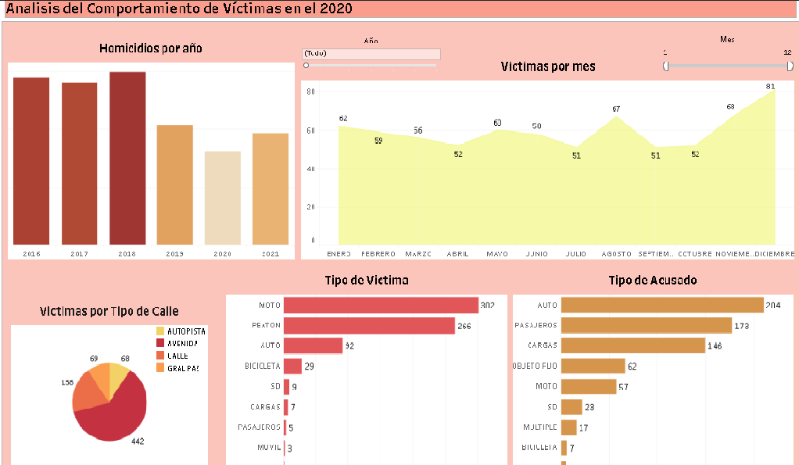
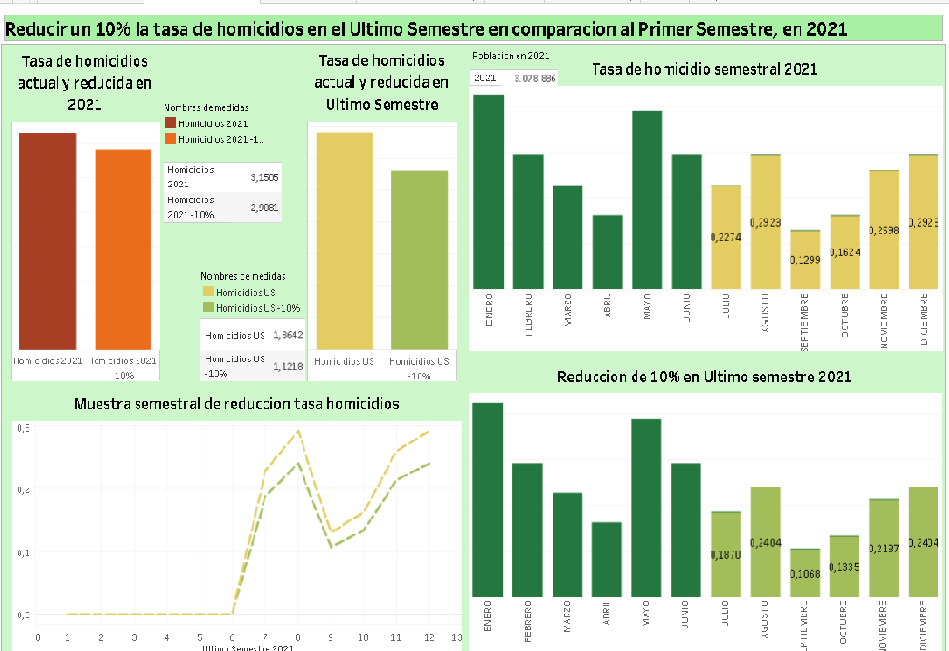
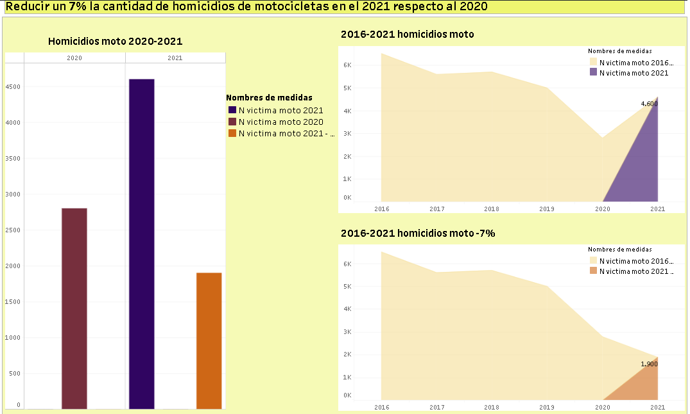

  

<h1 align='center'>Proyecto Individual 2</h1>

# <h1 align='center'>**`Siniestros viales`**</h1>

<h1 align='center'>Delfina Longo Peña</h3>

<strong>Índice</strong>

1. [Descripción](#descripción)
2. [EDA y ETL](#eda-y-etl)
3. [Dashboard y Análisis](#dashboard-y-análisis)
    - [Dashboard 1](#dashboard-1-análisis-del-comportamiento-de-víctimas-en-el-año-2020)
    - [Dashboard 2](#dashboard-2-reducir-en-un-10-la-tasa-de-homicidios-en-siniestros-viales-de-los-últimos-seis-meses-en-caba-en-comparación-con-la-tasa-de-homicidios-en-siniestros-viales-del-semestre-anterior-en-2021)
    - [Dashboard 3](#dashboard-3-reducir-en-un-7-la-cantidad-de-accidentes-mortales-de-motociclistas-en-el-2021-en-caba-respecto-a-2020)
      - [Link Dashboard](#link-dashboard)
4. [Stack Tecnológico](#stack-tecnológico)
    - [Lenguaje de Programación](#lenguaje-de-programación)
    - [Librerías de limpieza y análisis](#librerías-de-análisis-de-datos)
    - [Visualización de Datos](#visualización-de-datos)
    - [Herramienta de Visualización BI](#herramienta-de-visualización-bi)
5. [Contacto](#contacto)

# **Descripción**

En este proyecto, desempeño el papel de un analista de datos y tengo la responsabilidad de llevar a cabo un examen exhaustivo de los datos. El objetivo principal es generar información útil que pueda ser utilizada por las autoridades locales de la Ciudad de Buenos Aires. Esta información servirá para implementar medidas que reduzcan el número de víctimas mortales en incidentes de tráfico.
He recibido un conjunto de datos denominado 'homicidios', que contiene información recopilada en la Ciudad de Buenos Aires entre los años 2016 y 2021. Además, he integrado otro conjunto de datos denominado 'población', el cual proporciona información sobre la cantidad de habitantes en CABA durante el mismo período, con el fin de enriquecer el análisis.

# **EDA y ETL**

Realizo una limpieza de los datos, transformandolos para su uso.
Luego comienzo a buscar relaciones entre los datos y los represento en gráficos a las que me parecen interesantes. Pude identificar que el año con mayor numero de victimas fue en 2018, también que en el rango de 2016 a 2021 el tipo de victima con más número de victimas fueron las Motocicletas, y que los acusados que mas tuvieron incidente con ellas fueron los autos

# **Dashboard y Análisis**

## Dashboard 1: *'Análisis del Comportamiento de Víctimas en el Año 2020'*

Mi objetivo es presentar la evolución de los homicidios a lo largo del año 2020, destacando la disminución en el número de víctimas en comparación con los años 2016-2019 y 2021. Además, se señalará el mes con el mayor aumento, detallando el tipo de calle donde ocurrieron con mayor frecuencia, así como los tipos de víctimas, incluyendo sus acusados y la cantidad de casos en ese mes específico.

## Dashboard 2: *'Reducir en un 10% la tasa de homicidios en siniestros viales de los últimos seis meses, en CABA, en comparación con la tasa de homicidios en siniestros viales del semestre anterior en 2021'*

Definimos a la tasa de homicidios en siniestros viales como el número de víctimas fatales en accidentes de tránsito por cada 100,000 habitantes en un área geográfica durante un período de tiempo específico. Su fórmula es: (Número de homicidios en siniestros viales / Población total) * 100,000

## Dashboard 3: *'Reducir en un 7% la cantidad de accidentes mortales de motociclistas en el 2021, en CABA, respecto a 2020'*

Definimos a la cantidad de accidentes mortales de motociclistas en siniestros viales como el número absoluto de accidentes fatales en los que estuvieron involucradas víctimas que viajaban en moto en un determinado periodo temporal. Su fórmula para medir la evolución de los accidentes mortales con víctimas en moto es: (Número de accidentes mortales con víctimas en moto en el año anterior - Número de accidentes mortales con víctimas en moto en el año actual) / (Número de accidentes mortales con víctimas en moto en el año anterior) * 100

### Link Dashboard

[Siniestros Viales](https://public.tableau.com/views/SiniestrosViales_17052770362730/Dashboard1victimas?:language=en-US&publish=yes&:display_count=n&:origin=viz_share_link)

# **Stack Tecnológico**

## *Lenguaje de Programación:*

- 
  
  Para el desarrollo de la lógica y la funcionalidad de tu aplicación.

## *Librerías de Análisis de Datos:*

- 

  Para operaciones numéricas eficientes.

- 
  
  Para manipulación y análisis de datos estructurados.

## *Visualización de Datos:*

- 

  Para crear gráficos y visualizaciones estáticas en Python.

- 

  Para visualizaciones estadísticas atractivas y fáciles de usar.

## *Herramienta de Visualización BI:*

- 

  Para visualización y análisis de datos en tiempo real.

# **Contacto**

- Gmail: delfinapena55@gmail.com
- LinkedIn: [Delfina Longo Peña](www.linkedin.com/in/delfina-longo-peña-44b4b623b)
- Github: [delfinap5](https://github.com/delfinap5)

[def]: #link-dashboard